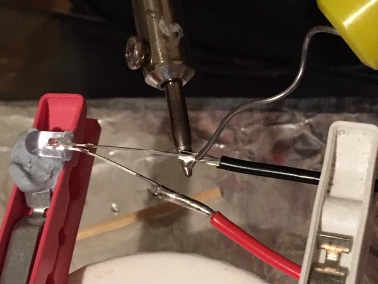
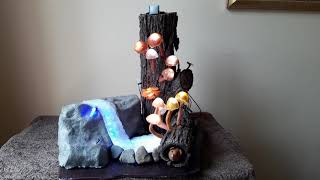

# 1701QCA Final project journal: *Emily Garred*

<!--- As for other assessments, fill out the following journal sections with information relevant to your project. --->

<!--- Markdown reference: https://guides.github.com/features/mastering-markdown/ --->

## Related projects ##
<!--- Find about 6 related projects to the project you choose. A project might be related through  function, technology, materials, fabrication, concept, or code. Don't forget to place an image of the related project in the appropriate folder and insert the filename in the appropriate places below. Copy the markdown block of code below for each project you are showing. --->

### *Insert name of related project here* ###

<!--- Modify code to insert image of related project below --->

<!--- Fill out name and link to related project in the code below. --->
[Name of related project](https://[URL of related project])

<!--- Include information about why this project is related to yours. --->

<!--- Repeat code above for a total of 6 related projects --->

### Related project 1 ###   
Night Light Assisstant

  https://create.arduino.cc/projecthub/gabriele_fugazzi/night-light-assistant-0d9bf0?ref=tag&ref_id=motion%20sensor&offset=4
  

This project is related to mine because it uses the input of a PIR Motion Detector to turn on lights to assist at night.  This function is the same principal to my original concepts however in my final project this was reversed with the lights coming on when there is no movement.

### Related project 2 ###   
Magical Mushroom Lights

https://www.youtube.com/watch?v=D5LjGFkpApw

This project is related to mine because it uses LEDs to make fake mushrooms glow.  I like the way he created the realistic looking mushrooms and hope to use a similar process to make the mushrooms for my project.  However in my environment the mushrooms will be controlled by the input of the motion detector.

### Related project 3 ###   
Jelly Swarm

https://www.tangibleinteraction.com/artworks/jelly-swarm

This project is related to mine because it takes the idea of real world creatures and brings them to a state where we can learn about them by showing how the interaction of people can effect them in the wild.  This same idea is demonstrated in my project as it takes the real life reactions of wild life to an unknown presence.  The paper jellyfish were lit by LEDs which change colour and react with eachother when undisturbed but react differently when effected by humans via a sensor.

### Related project 4 ###   
People Create Space and Time, at the Confluence of their Spacetime New Space and Time is Born

https://www.teamlab.art/w/people_create_space/

This project is related to mine because it uses the same principal of stillness.  In this light display when a person remains still the projection creates a very slow ripple effect which radiates from them across the room creating a peacfull 
experience.  My project also used this continued stillness to have an effect on the environment with the project only coming to life when there is no motion.

### Related project 5 ###   
Play With Fire Over WIFI

https://create.arduino.cc/projecthub/electropeak/play-with-fire-over-wi-fi-esp8266-neopixels-android-app-26c4ad?ref=tag&ref_id=led%20strip&offset=5

This project is related to mine because the effect demonstrated to create the fire uses a NeoPixel LED strip.  I got the idea of including a running water effect from this project as when the light turns blue it reminded me of water. 

### Related project 6 ###   
Flutter of Butterflies Beyond Borders, Ephemeral Life Born from People

https://www.teamlab.art/w/butterflies_ephemerallife_people/

This project is related to mine because when a person stands still it allows for projections of butterflies to grow on them before flying away and navigating the space on their own.  This takes the same idea with the stillness and adds life to it albeit in a non-material form and replicates my idea of stillness welcoming life.

## Other research ##
<!--- Include here any other relevant research you have done. This might include identifying readings, tutorials, videos, technical documents, or other resources that have been helpful. For each particular source, add a comment or two about why it is relevant or what you have taken from it. You should include a reference or link to each of these resources. --->

#### Micro:bit Lesson 3. NeoPixels with Micro:bit ####

https://learn.adafruit.com/micro-bit-lesson-3-neopixels-with-micro-bit/software

This website gave me a good understanding of the basics of programing a NeoPixel with a Microbit to get the desired effect to make the LED strip appear as flowing water.  I was able to experiment with different colour, brightness and movement of the lights.

#### LED Strip Effects ####

https://www.tweaking4all.com/hardware/arduino/adruino-led-strip-effects/

This website gave me lots of examples of what could be done with the NeoPixel strip and what effect could make the best running water however the programing was made for Arduino and couldn't be used with the Microbit.  The videos also showed how to give a more diffused and glowing effect by placing a thin material like tissue just above the lights. 

#### Connecting a PIR motion sensor to a Micro:bit ####

https://www.teachwithict.com/pir.html

This basic tutorial on how to connect the Microbit to the PIR motion detector gave me a simple code however had very unreliable results.  I found that even when the sensor was totaly covered the indicator light on the Microbit continued to switch between the two inputs.

#### How PIR modules work and using them to control LED strings. ####

https://www.youtube.com/watch?v=evZM2_RTvTU

This indepth video tutorial gave me extensive information on how the PIR motion detector works, how to adjust different components to get better results and how to make a basic circuit using LEDs.  This helped solve the problems experienced from the previous website.

#### Microbit + Spotify ####

https://www.hackster.io/samelhusseini/microbit-spotify-windows-8a8551

I had an idea to also connect the Microbit to play forest sound effects along with the other components to add another layer of realism to the environment.  This tutorial gave detailed instructions and seemed effective however it would have needed two Microbits, plus another program that would allow the Microbit to communicate with the computer and Spotify.  This extra expense coupled with the unfamiliar program and coding required on my computer prompted me to reconsider this idea.

#### Inventors Kit Experiment 4 ####

https://www.kitronik.co.uk/blog/experiment-4-using-a-transistor-to-drive-a-motor/

I used the coding in this experiment as inspiration to give the fireflies a fluctuating glow.  This allowed me to control the LEDs making them illuminate gratually and pulse in a realistic manner. 

#### How to Solder Wires Together (Best tips and tricks) ####

https://www.youtube.com/watch?v=Zu3TYBs65FM

This was a very useful video in the basics of soldering.  I learnt how to strip the wires, different ways to join them, the best way to solder by putting the heat from the bottom and the solder from the top.  The video also suggested using a damp sponge to clean the tip of the soldering iron and using heat shrink to protect the soldered wires from coming in contact with each other which would cause issues. It also recommended using clips to help hold the wires in place while solering, to stop them moving and protect fingers from the hot iron.

## Conceptual development ##

### Design intent ###
<!--- Include your design intent here. It should be about a 10 word phrase/sentence. --->
To create a small glowing environment to be used as a decorative or practical and calming sourse of light.

### Design ideation ###
<!--- Document your ideation process. This will include the design concepts presented for assessment 2. You can copy and paste that information here. --->

#### Design concept 1 ####

Design concept 1 is both a decorative and practical light that uses a distance sensor to activate the system of  glowing and moving  plant life.  The distance sensors would make different parts of the environment come on and get brighter as someone walks closer to it then slowly turn off as they get further away.  With the addition of a fan to make the plants move around like there was wind.  This could be both a novelty item or used as a night light to make a practical safety light in the dark.

While experimenting with this idea I found the distance sensor was difficult to work with, however after a bit of reseach and trial and error I found that the sensor needed more power. After adding an additional battery pack I got it to work with the LEDs and fan coming on at different times.

#### Design concept 2 ####

The second concept is an extention of the initial idea with the potential to expand it into a large scale installation of a living environment that comes on and off with varying degrees of brightness when someone passes through it.  This would include glowing plant life, flowing water (using LED strips), immersive forest sounds, insects like fireflies and a fan to create movement and add to the realism.  Within the given time and scope of this project, the resulting experimental model could only be a small section of the overall concept.

I found basic instructions on how to make different effects with the Neo Pixel strips and had to do alot of testing to make it look like flowing water rather than just flashing lights.

### Final design concept ###
<!--- This should be a description of your concept including its context, motivation, or other relevant information you used to decide on this concept. --->
The final design concept is a small "living" environment consisting of the same glowing plant life, water, fireflies and servo motor.  This time however, using a PIR motion detector instead of a distance sensor, thereby making  a more realistic interaction between the person and environment.  By having the environment come to life when it senses no movement would replicate the real world wildlife where by, when movement is sensed the elements of the display "go into hiding".  By using the Microbit and the PIR Sensor, I would program the various elements of the display to come on (out of hiding) at different time intervals after no movement was detected, and go off again (into hiding) when there was movement.  

To create this project, I would begin by testing the various elements on the breadboard, before proceeding to incorporate them into my environment.  This I would create using actual wooden logs (rescued from the fire pit) and a fabricated "rock" made from papier-mache covered with air drying clay.  This would all be mounted on a base, painted and after the various elements were correctly wired(soldered) etc decorated with other plant life etc to complement the overall visual appeal of the project. For the mushrooms, I plan to mould them with silicon around the led, with the wiring continuing through the stem of the mushroom.  The fireflies, would be mounted using a yellow led decorated with celophane wings.  To inhabit the hollow log I will place a small animal attached to the arm of a servo motor which will poke in and out of the log.

### Interaction flowchart ###
<!--- Include an interaction flowchart of the interaction process in your project. Make sure you think about all the stages of interaction step-by-step. Also make sure that you consider actions a user might take that aren't what you intend in an ideal use case. Insert an image of it below. It might just be a photo of a hand-drawn sketch, not a carefully drawn digital diagram. It just needs to be legible. --->

## Process documentation ##
<!--- In this section, include text and images (and potentially links to video) that represent the development of your project including sources you've found (URLs and written references), choices you've made, sketches you've done, iterations completed, materials you've investigated, and code samples. Use the markdown reference for help in formatting the material.

This should have quite a lot of information! It will likely include most of the process documentation from assessment 2 which can be copied and pasted here.

Use subheadings to structure this code. See https://guides.github.com/features/mastering-markdown/ for details of how to insert subheadings.

There will likely by a dozen or so images of the project under construction. The images should help explain why you've made the choices you've made as well as what you have done. --->

### Initial Coding ###

For this project I began with the programing for the NeoPixel LED strip.  After reasearching how to control it and what could be done to get different effects I started experimenting with getting different patterns and colours that best replicate running water.

The below video shows the initial ripiling effect I achieved and also how it looks being half covered by a tissue to get a more despersed glowing effect.

This is the code used to get this effect by changing the colour of every second LED gave the moving effect.  I found it was possible to change the number of LEDs that moved or to even put a gap in between them to produce various outcomes.

The next step I took was to connect the motion sensor to the lights and adjust the coding to get the fluctuating light effect for the fireflies.

The below code and video demonsrates the combined elements of the project with the motion sensor triggering the LEDs and Strip to react to the motion input.  I plan to make the seperate parts come on at different intervals with continued absence of motion.

### Environment Fabrication ###

After successfully completing a basic mock-up of the final concept I decided to start on the fabrication of the environment.  The image shows the basic shape for the rock which will support the LED strip.  I made this using papier mache over a small cardboard box (see image below), and then have covered it in a thin layer of air drying clay, which I then painted to look like a rock.  I also selected some wood from a fire heap that were suitable to use as supports for the mushroom and firefly lights.

### Mushroom Fabrication ###

#### Initial Wiring ####

With everything working I began to create the final electronic components for the mushrooms.
The first step was to learn how to solder. A Youtube video by ChrisFix (see link above under "Other Research") was very helpful and gave me lots of tips as to the best way to approach this task.
I began by soldering one led to short lengths of wire and testing with a battery - It worked 

Next I needed to calculate how much wire I would need for the different mushrooms.  With two different places having mushrooms, I needed varying lengths of wire to get back to the microbit.
I cut my lengths, allowing for the stem of the mushroom, the distance through the log and some extra at the end to enable me to join the various wires together, before attaching to the microbit.

With the lengths cut, I went ahead and soldered all the wires to the LEDs 

I then used heat shrink to cover the join on one leg to prevet the wires touching and causing electrical issues.

With all the stems soldered, I needed to work out how I would attach the mushroom tops, and constructed little wire loops, which I attached to the other leg of the led with some more heat shrink.

#### Creating Mushrooms ####

Before I could put the wiring in place on the logs, I needed to create the mushroom stems around their wires.
For this I used silicon as in the video "Making Magical Mushrooms" (see link Related Project 2 above).

As this was a messy process, I made the mushroom tops at the same time.

For the tops, I squeezed out a bit of silicon and mixed in a small amount of water colour paint, to tint the silicon to the appropriate colour.  I then placed a blob onto some cling wrap, folding it over to cover the silicon, which was in the center.  Next I shaped the silicon into a flat circle (usually 3 - 6 cm in diameter) and then using a domed mould (wooden mushrooms) shaped the circle over the mould, leaving it to dry for a few hours.  For the stems, I used the same colour mixing process, but this time when the silicon was placed on the cling wrap, I added one of the prewired leds, then folded over the wrap, with the wire in the fold then spread the silicon along the wires to create the stem. After making the first stem, I decided to paint the wires white, as the black and red wiring could be seen through the silicon. The last element I created using this process was the fungus.  To make these, I used the same process as the mushroom tops, but this time only creating a semi-circle in various sizes.  This was then moulded around the same mushroom moulds, but removed before they were completely dry, I then turned the curved shape inside out and threaded the fungus onto wooden skewer to set completely.  To hold this shape I used an extra bit of silicon in the top to create the smooth top on the mushroom.  I used a small ball of cling wrap to fill the place where the led would go on the biggest one.  

WIth the mushrooms made I checked how the mushroom tops would sit over the supports I had created for them.  With the LED lit, it caused a focused spot of light on the top of the dome.  I remembered in the magic mushroom video that they cut the top off the LED, to help difuse the light.  I tried this with a spare led, cutting the domed end off with scissors.  The LED still worked, and when tested under the dome, I found the focused spot was gone.  I then went ahead and cut the tops off all the LEDs.

Finally with all the stems made, I was able to attach the stems to the logs, where they would be mounted for my scene.  I worked out the thickness of the stem and chose a drill bit of similar size, before drilling holes in the logs, at the desired positions.  With the holes done, I threaded the wires through the log (adding masking tape to each pair to avoid getting the wires mixed up).  I also inserted cylinders from toilet rolls into the hollow log, to keep the wires neat and make space through the centre.  

#### Connecting Circuits ####

Next it was time to join the wiring together.  For the final project, I wanted to group some mushrooms from the log with some from the tree, with the different groups coming on at different times.

I took sets of 2 or 3 wires from each log and soldered them together as sets of either positve or negative wires. 

I then attached each of these grouped wires to one wire, which enabled me to join the elements from the two logs together. (ie. From 10 LED mushrooms, I had only 2 positive and two negative wires to attach to the microbit).

Using the circuitry from the fan experiment (Inventors kit experiment 4, under "other research" above) I added a transistor to the negative wires, with a resistor on the middle leg. 

From the resistor I added a small length of wire cut from a female jumper wire, which enabled me to plug this into the pins on the microbit breakout board. The other leg was attached to a short length of wire which was soldered to the ground position on the edge connector.  
The positive wires were attached directly to the edge connetor on the 3V section of the bearkout board.  

Finally I tested all the mushrooms joined in place.

### Insect Fabrication ###

As another form of life in the environment I added some fireflies and a dragonfly.  These were all based on the same LED wiring of the mushrooms, with a transistor and resistor in each circuit.

#### Fireflies ####

I chose to use yellow LEDs for the fireflies and as I wanted them to gently flucuate I chose to put the three on to two different timed circuits.  After placing the mushrooms I used the fireflies to "fill in the gaps" and I cut the wires to the appropriate lengths and soldered them to the LEDs.  As I wanted one of the fireflies to be flying I used a piece of floral stem wire (which I tested and found it was conductive) as the positive wire for the LED, this enabled me to wind the negative wire around the supporting wire to keep it neat. I made a loop of the stem wire at the base for it to stand on, which I secured with electrical tape, then souldered a normal wire to the end to take it back to the microbit.

Next I mouled the bodies for the fireflies using polymer clay (which sets in the oven) that I then painted black.  To attach these I bent the LED to make it a right angle to the legs then using a small amount of silicone attached the boies to the base of the LED.  For the wings I used the thin plastic windows from envelopes and cut out small wings which were also attached with silicone.

#### Dragonfly ####

The Dragonfly was made using a similar method however this time I chose a blue LED and moulded a long tail with clear silicone around the LED so the light would travel down the tail to light it up.  I made the head and wings using the same method as the fireflies.  As I didnt want the dragonfly to fluctuate I soldered it the one of the mushroom circuits (see image below).

### Water Fabrication ###

The water effect was made using a Neopixel LED strip (50cm - 30 RGB LEDs).  I secured the Led strip to the channel in the fake rock using silicone.  To support the LED strip in the curved shape for the pond I used a small strip of cardboard which I taped to the base board.  I also added a circle of aluminium foil which I crumpled up a bit to help reflect the light to fill up the surface of the water. 

For the surface of the water I used silicone on a piece of baking paper which I spread then molded to create flowing and rippling textures.  This didnt come off the paper as easily as I had hoped, but I was able to get enough off that it is unnoticable.  I found however that the left over paper also helps to diffuse the light more.  All that was left to do was trim away any bits that were too wide then the silicone was able to just sit in place over the LED strip.

To connect the strip to the Microbit, I had to cut off the crocodile clips (which came as part of the strip) to solder them to a longer wire then to the female jumper wires which connected it to the coresponding Pins on the Microbit. 

### Mouse Fabrication ###

As I was lucky enough to find a hollow log, I thought it would be cute to add in a small mouse that pokes it's nose out of the hole as part of the display.  As preiviously stated, I used toilet roll cylinders to both keep the mushroom wiring out of the way and also make a smooth path that the mouse wouldnt get caught on.  To make the mouse I made a simple cone shape out of a semi-circle of felt. Adding simple eyes, ears and nose, with a small loop on the back to attach to the servo motor using another piece of the florist wire.  The servo motor was mounted on a empty matchbox at the back of the log with the wire attached via a tiny screw to the outer most hole on the arm of the motor. 

The code for this was fairly simple and does a simple 180 degrees turn to pull and push the mouse in reaction to the movement.  The wires were connected to the corresponding places on the breakout board using jumper wires however I had to cut off the plug of the 3v wire as it needed to be soldered to the holes on the board as there were no more avalable pins.

### PIR Motion Sensor ###

For the motion sensor I decided to place it on the top of the tall log however because of the height the wires needed to be extended so they could reach the Microbit via the female jumper wires.  To do this I cut the plugs off one side of two sets of jumper wires and soldered a small length of wire between them both. I was then able to plug it into the pins on the Microbit.
The below photos show the complete wiring and setup of the project.

### Test ###

While I was constantly testing the connections during the process of getting to this point with everthing together the project was now flashing and the motion sensor was not functioning correctly (see below video).

After looking at possible causes and solutions online I consulted my instructor for advice.  He suggested adding additional battery power to the motion sensor, LED strip and servo motor.  I decided to add two additional battery packs, one for the PIR motion detector (as everything  relied on that to work properly) and one for both the LED strip and servo motor. The two AAA batery packs that I purhcased didn't have a switch, so I installed a simple button switch so I didn't need to remove the batteries every time I wanted to turn it off.   To do this, I cut the plugs off the jumperwires for the PIR Sensor and connected the positive wire through the switch to the battery, and soldered the negative wire directly to the negative battery wire. The code pin still went straight to the Microbit.  For the servo motor and LED strip, I also cut off their connecting plugs/clips and soldered the negative wires together, then attached that to the negative wire from the battery pack.  Similarly, the positive wires were connected through the switch to the positive wire on the battery pack.  Finally the code wire for each element, went back to the Microbit. 

After implementing these the motion detector was working reliably as were the other two components.  However the mushrooms were still flashing.  While trying to work out the problem, I had a transisor leg break off. I wondered if there could be a problem with the connection from the LEDs through the transistors to the Microbit.  So to be sure cut them all off and redid the connections with new trastistors and wiring.

To keep the legs from beaking again I insulated the connections then taped them together to stop them from bending and breaking again.  I also used longer wires from the transistor to the Microbut to allow for more maneuverability 

After rewiring each section I tested the connections and everything seemed fine however once they were hooked up to the microbit the mushrooms were still flashing.  I then went back to the code and tried the mushrooms on every other avaliable pin and the problems persited, as the mushrooms were origionaly designed to fade on and off I changed to code to be just on then off.  This worked but they were extremely bright compared to the other elements, so I changed to code to be half brightness, unfortunately they began flashing again. After more trial and error I decided to leave the mushrooms at full brightness and adjust the code so the different elements came on in succession.

Finaly I had a system that was working.

### Decorations ###

With all the mushrooms working I siliconed the dome tops in place and for the ones on the tree I also siliconed the domes to the tree as they were too heavy.  
Next I used some fake vines and hot glued them to the tree and a bit growing around the sides.  I also cut some grass from some paper which was painted green and finally, added some fake moss and small rocks from the garden around the edges and to fill in any gaps in the scene.

## Final code ##

<!--- Include here screenshots of the final code you used in the project if it is done with block coding. If you have used javascript, micropython, C, or other code, include it as text formatted as code using a series of three backticks ` before and after the code block. See https://guides.github.com/features/mastering-markdown/ for more information about that formatting. --->

## Design process discussion ##
<!--- Discuss your process used in this project, particularly with reference to aspects of the Double Diamond design methodology or other relevant design process. --->

My process for developing this project has involved a lot of research and trial and error.  Throughout I have revised and refined my concept to reflect some of the things which have worked well and some which have not.  This evolution is a reflection of the "Double Diamond" process where a concept is discovered or concieved, defined as a concept by setting parameters for the possible project, developed through research, testing and then adjusting, and finally delivered as a funcitioning product.  This evolution has mostly been from my own development and discovery process as there was very little feedback happening through the discussion board. I feel that the feedback process would have been much easier had we been able to study in a classroom setting as it gives immediate feedback unlike the delay between posting and responding.

Over the course of this project, I have discovered ways to control the various elements of the environment to work on different timings for lights to display brighter or dimmer and how to control the led strip.  I have also learnt to combine a range of different elements to work in conjunction with each other - (lights, strip, sensor, servo motor).  I experimented first with a distance sensor, so elements would go on and off as something approached and passed by, however by redefining my concept, I decided to focus on tranquility, which would be better controlled by the PIR sensor.  This sensor was problematic to control, however after further research and the discovery of the adjustable controls on the device, I was able to get the result I wanted. This whole process has been a cycle of discovery and redefining as different wiring and coding designs have been tested, adjusted and either developed or discarded.

The next challenge involvolved working out how to transplant my idea from the breadboard into a functioning project.  I watched a useful video (see link above) about how to solder, and cautiously tested my new soldering iron on a couple of small pieces of wire and some LED's.  To my surprise, soldering was fairly easy. I would not say I was great at solering, and some of the joins aren't very neat, but everything was tested as it was completed and it all worked. When it came to joining the electrical elements however, I was unsure how to link the elements together, and some helpful advice was received from my instructor.  

The creative part of the project, (making mushrooms) was fun and worked quite well.  After making one stem, I realised that the silicone was not opaque enough to hide the black and red wiring, so decided to paint the wires first. I also got better at making the mushrooms stems and tops as I went along, learning easier ways to get the desired result. Other parts, like the bodies for the insects were easy, as I had used the polymer clay many times before.  

The main drama was once everything was linked up, there was possibly too much power being used by the various elements than could be supplied through the Microbit.  When no helpful solution could be found online, I again received advice from my instructor which helped iron out much of the problem.  In the end I believe there may have been a fault in the breakout board, as I could only get the mushroom LED's to funcition on one pin, (I progressively changed the code to test the element on all the available pins) causing me to discard some of my code, and modify their opperation to a straight on/off. 

Again, there was a lot of trial and error in the wiring process, with a couple of transistors breaking, late in the process, and causing me to rewire a large section of the project, just incase the others were going to break too.  

Had we been able to go to class, I believe this project would have been quite different, as I travel on the train, and don't think I would have been able to transport all the environment elements easily each week.  However, I am glad in a way that I did not have that problem, because I think that I have ended up with a much better project. 

## Reflection ##

<!--- Describe the parts of your project you felt were most successful and the parts that could have done with improvement, whether in terms of outcome, process, or understanding.

What techniques, approaches, skills, or information did you find useful from other sources (such as the related projects you identified earlier)?

What parts of your project do you feel are novel. This is IMPORTANT to help justify a key component of the assessment rubric.

What might be an interesting extension of this project? In what other contexts might this project be used? --->

Overall I am very happy with the final project outcome.  It looks pretty much as I imagined it would and besides some concessions to the final program works as intended.  I am particularly happy that I decided to leave out the fan (which was intended to give movement to the plants and flying firefly) and replace it with the sevo motor.  The addition of a little mouse popping out of the hollow log, gives a lighthearted element of surprise and adds to the realistic feel of the scene.
The final finish of the mushrooms is good, however, I feel they may be slightly too big for the scene.  I ended up with a slightly larger gauge of electrical wire, than I inteded and hoped that these wires would be strong enough to support the mushrooms on their own.  The original project which inspired this one, (Making Magical Mushrooms, see above) had a length of stiff wire through the stem, which would have given stronger support for the tops and better flexiblilty to the stems.  Smaller gauge wire, would have meant the stems could have been narrower and therefore the size of the  whole mushroom could have been reduced. I had a lot of problems with the wiring/ coding for the mushrooms.  While they worked fine on the breadboard and individually, when the were all linked back to the Microbit, they flashed eratically.  The addition of extra power supplies for other elements, took some of the power consumption out of the circuit, but the mushrooms still flashed.  I tried, lots of different pins, and playing with the code, and finally had to settle for all the mushrooms coming on at once, and all at full brightness.  (Anything other than full brightness made them flash)  I had inteded some mushrooms from each log coming on as two separate groups, and fading on and off, but this turned out not to be possible.  (I do suspect there is a problem with some of the pins on the breakout board, as I could only get the mushrooms to work on that one pin).
I am very pleased with the final effect of the water and the ripple affect I was able to achieve.  The silione water also looks great, although I would try making in on some other surface in future, as it was near impossible to remove from the baking paper. 
I also like the way the insects turned out.  The wings look good, especially on the fireflys, however on the dragon fly they were a bit hard to see once it was lit up.  I do however, really like the way the silicon tail carries the light along it.

Having never done anything like this before, I am pleased with the result, however I believe that a better understanding of electronics and how the electrical elements work together, may have saved a lot of time and stress and redoing things, which may not have needed to be done.  Early on in the building process, I purchased a switch for the Microbit power supply, as I thought it would more practical and safer than pulling out the little plug all the time.  Unfortunately, I misunderstood the sales person who sold it to me, and I put both the positive and negative wires through the switch.  This very quickly overheated and melted the battery case and split the covers on the batteries (oops).  I feel that the block coding for the Microbit was fairly straight forward, and I was able to get most of the effects I wanted fairly easily, with the help of Google and You Tube.  

As mentioned above, my original idea for the this project, came from the Making Magic Mushrooms video, which I saw on You Tube.  This was purely a decorative light, which opperated only with an on off switch.  I expanded on this concept by making my mushrooms interactive, with the addition of the PIR motion sensor.  The more I thought about this concept, the more it grew, I added in the Fireflies, (which fade on and off intermittently), the water feature (when I saw the light strip online) and finally, thanks to finding a lovely hollow log, I added the little mouse, which pops out to say hi. I believe that it is this interactive feature and combination of elements which make this a novel and engaging project. This concept could be both decorative, relaxing and enteraining, depending on who you were targeting it at.  For example, what little kid wouldn't like to play peek-a-boo with a mouse. In an alternate mode, the scene could just be used as a night light, or decoration, where the elements stay on.  

With the project turned on, there is no instruction needed for a potential user, their attention would be caught, upon entering a room, with the lights etc going out.  Upon investigation, they would undoubtedly stand still to look at the project, at which point things would start to come back on.  If they moved, the project would go off again, and they would quickly learn that it was their movement which was triggering the reaction. This makes this project extremely user friendly.  

**Still Life** lends itself to many future expansion possibilities.  As it is, it could be francised to Disney for example, with Snow White, in the forest with all the animals coming out to meet her.  Alternatly, it could incorporate, fairys, or other mythical creatures, such as dragons or unicorns. I could also include little coloured fish to move around in circles in the pond (possibly with another motor) or a cluster of quartz crystals which would enhance the magical feel of the project. Another possible use, would be as a Halloween decoration, with spooky elements like spiders, included into the scene.  I could also imagine this project as a full room size interactive art installation, where people could slowly move through the magical environment, triggering various parts to come on or go off as they moved through.  At this scale, I could incorporate some of the other creatures mentioned above and have light up flowers to truly make **Still Life** into a magical Wonderland. 

